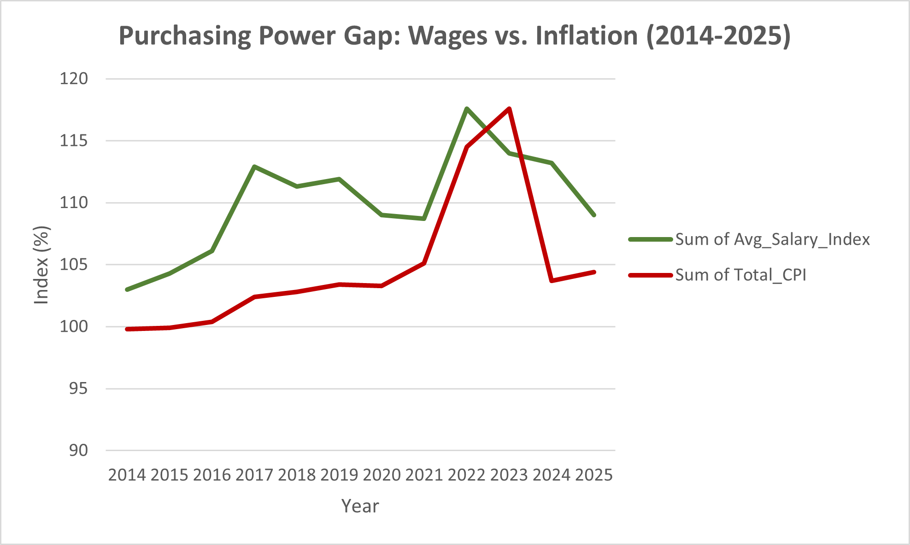

# Purchasing Power Analysis: Wages vs. Inflation in Hungary (2014-2025)

## 1. Executive Summary
This project quantifies the impact of record-breaking inflation on Hungarian household wealth. By correlating CPI and Wage indices, the analysis identifies the "Real Growth Gap," revealing how purchasing power was neutralized by economic volatility despite nominal salary increases.

---

## 2. The Tech Stack
* **SQL:** Google BigQuery
* **Data Cleaning:** Microsoft Excel
* **Visualization:** Python (Matplotlib/Seaborn)
* **Data Source:** Hungarian Central Statistical Office (KSH)

---

## 3. Business Problem
In 2023, Hungary’s inflation reached a peak of 17.6%. For policymakers and businesses, nominal wage growth figures were misleading. This study identifies the "Real Growth"—the actual purchasing power remaining—to provide a data-driven baseline for future fiscal strategy and labor cost forecasting.

---

## 4. Technical Process: SQL Implementation
I implemented a relational model in BigQuery to unify independent salary and inflation datasets, calculating the net economic impact per year.
```sql
SELECT 
  s.Year, 
  s.Avg_Salary_Index, 
  i.Total_CPI,
  ROUND(s.Avg_Salary_Index - i.Total_CPI, 2) AS Real_Growth
FROM 
  `gee-course-465115.hungary_economy.Salaries` AS s
JOIN 
  `gee-course-465115.hungary_economy.inflation_data` AS i 
  ON s.Year = i.Year
ORDER BY 
  s.Year ASC
```
## 5. Results & Analysis
* **The 2023 Deficit:** Despite a 14% nominal wage increase, the 17.6% inflation rate created a negative real growth of -3.6%, marking the most significant wealth contraction in the analyzed period.
* **Electoral Cycle Peak:** Analysis confirms that 2022 (election year) saw the highest nominal wage spike (+17.6%), which was later neutralized by the 2023 post-election inflationary surge.
* **Recovery (2024):** A sharp 9.5% rebound in real growth suggests successful economic stabilization and a restoration of consumer confidence.

*Figure 1: Comparison between Wage Growth and Total CPI (Inflation) in Hungary (2014-2025).*
---

## 6. Business Recommendation
Based on the -3.6% contraction identified in 2023, organizations should anticipate upward pressure on wage demands as labor markets seek to recover lost purchasing power. For strategic fiscal planning, I recommend indexing long-term salary budgets against a 3-year rolling average of the CPI to mitigate the impact of volatile inflation spikes and maintain operational stability.

## Author
**María Castillo**
